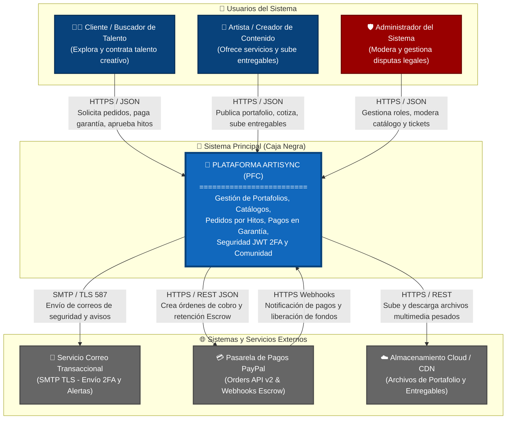

# Diagrama C4 Nivel 1: Contexto del Sistema (System Context) - Artisync PFC

Este documento describe el **Nivel 1 (Contexto del Sistema)** de la metodología **C4 Model** (desarrollada por Simon Brown) para la **Plataforma de Gestión para Artistas y Creadores de Contenido (Artisync / PFC)**.

El diagrama de contexto sitúa al sistema **Artisync** como una **caja negra** central y muestra los límites globales del sistema, identificando a los **actores (usuarios que interactúan)** y los **sistemas y servicios externos** con los que el sistema se comunica para cumplir con sus requisitos de negocio.

---

## 1. Identificación de Elementos del Nivel 1

### 1.1 El Sistema Central (Caja Negra)
| Sistema | Descripción y Alcance |
| :--- | :--- |
| **Artisync (Plataforma PFC)** | Plataforma web integral y colaborativa que conecta a artistas creativos y creadores de contenido con clientes, gestionando catálogos de servicios, cotizaciones personalizadas, flujos de trabajo en hitos, contratos legales, depósitos en garantía (escrow), comunidad social y comunicación en tiempo real. |

---

### 1.2 Usuarios y Actores (People / Actors)
| Actor / Rol | Tipo | Descripción y Responsabilidades en el Sistema |
| :--- | :--- | :--- |
| **Cliente / Buscador de Talento** | Usuario Final | Persona física, marca o empresa interesada en buscar, explorar y contratar servicios creativos. Explora portafolios verificados, solicita cotizaciones, contrata proyectos, realiza depósitos en garantía, aprueba hitos de trabajo y califica los entregables finales. |
| **Artista / Creador de Contenido** | Usuario Final / Creativo | Profesional creativo independiente (ilustrador, músico, editor, diseñador, animador) que se registra en la plataforma, verifica su perfil, publica su portafolio y catálogo de servicios con tarifas, gestiona pedidos activos, sube entregables por hito y recibe pagos liberados. |
| **Administrador de la Plataforma** | Usuario Interno / Moderador | Personal técnico o administrativo de Artisync con acceso privilegiado. Gestiona el alta y bloqueo de cuentas de usuario, administra roles y permisos granulares (`RolePermission`), modera el catálogo de servicios, resuelve disputas legales/tickets de revisión entre clientes y creadores (`TicketRevision`), y monitorea métricas operativas del sistema. |

---

### 1.3 Sistemas Externos (External Systems)
| Sistema Externo | Tipo | Protocolo & Tecnología | Descripción y Justificación de Interacción |
| :--- | :--- | :--- | :--- |
| **Servicio de Correo Electrónico (SMTP Transaccional)** | Sistema de Notificaciones | `SMTP / TLS` <br> (Puerto 587) | Sistema de correo saliente (ej. Gmail SMTP, SendGrid, Amazon SES) consumido por la plataforma (`EmailService`) para enviar correos transaccionales asíncronos (`@Async`): códigos de autenticación de dos factores (2FA), enlaces de verificación de cuenta y recuperación de contraseña (`tokenPlano`), y alertas de estado de pedidos. |
| **Pasarela de Pagos Externa (PayPal API v2)** | Pasarela Financiera REST | `HTTPS / REST JSON` <br> (Webhooks & Orders v2) | Plataforma financiera global (`PayPalConfig`, `PayPalWebhookControlador`) invocada para procesar pagos seguros. Gestiona la creación de órdenes de cobro, la retención de fondos en garantía (*Escrow*) durante la ejecución de los pedidos (`PagoGarantia`) y la notificación de eventos transaccionales vía Webhooks firmados. |
| **Almacenamiento de Archivos en Nube (Cloud Storage / CDN)** | Sistema de Almacenamiento | `HTTPS / REST` <br> (S3 / Cloudinary) | Infraestructura externa para el almacenamiento y distribución optimizada de recursos estáticos de alto volumen: imágenes y videos multimedia de portafolios artísticos, adjuntos de chat entre usuarios y archivos entregables de proyectos de alta resolución. |

---

## 2. Código DSL para Structurizr Lite (Gratuito)

El siguiente código está formateado en el **DSL (Domain Specific Language)** de **Structurizr** (`https://structurizr.com/dsl`). Puede ser ejecutado localmente en **Structurizr Lite** (vía Docker: `docker run -it --rm -p 8080:8080 structurizr/lite`) para renderizar interactivamente el diagrama del sistema.

```groovy
workspace "Artisync - Plataforma para Artistas y Creadores de Contenido" "Diagrama C4 Nivel 1: Contexto del Sistema de Gestión Creativa" {

    model {
        // Actores / Usuarios
        cliente = person "Cliente / Buscador de Talento" "Usuario que busca servicios creativos, contrata artistas, aprueba hitos y realiza depósitos seguros en garantía." "Person"
        artista = person "Artista / Creador de Contenido" "Profesional creativo que ofrece sus servicios, gestiona portafolio, cotiza pedidos y sube entregables." "Person"
        admin = person "Administrador del Sistema" "Usuario interno de Artisync que gestiona roles, modera catálogos, resuelve disputas y supervisa la seguridad." "Admin"

        // Sistema Principal (Caja Negra)
        artisyncSystem = softwareSystem "Plataforma Artisync (PFC)" "Plataforma web integral de intermediación, gestión de flujos creativos en hitos, pagos en garantía y comunidad social para artistas y clientes." "System"

        // Sistemas Externos
        smtpSystem = softwareSystem "Servicio de Correo Transaccional" "Servidor SMTP saliente (Gmail / SendGrid) para envío de correos de recuperación de contraseña, 2FA y alertas transaccionales." "External System"
        paypalSystem = softwareSystem "Pasarela de Pagos (PayPal API v2)" "Plataforma financiera externa para procesamiento de transacciones, retención de fondos en garantía (Escrow) y notificaciones de pago vía Webhooks." "External System"
        cloudStorageSystem = softwareSystem "Almacenamiento en Nube / CDN" "Servicio externo (AWS S3 / Cloudinary) para almacenamiento persistente y streaming de archivos multimedia de portafolios y entregables." "External System"

        // Relaciones: Usuarios -> Sistema Artisync
        cliente -> artisyncSystem "Explora catálogo, solicita cotizaciones, realiza pagos en garantía, revisa hitos y califica entregables" "HTTPS / JSON"
        artista -> artisyncSystem "Publica portafolio y catálogo, gestiona pedidos, envía avances de hitos y cobra por servicios entregados" "HTTPS / JSON"
        admin -> artisyncSystem "Administra usuarios, asigna roles, modera catálogos y arbitra tickets de revisión legal" "HTTPS / JSON"

        // Relaciones: Sistema Artisync -> Sistemas Externos
        artisyncSystem -> smtpSystem "Envía correos asíncronos de verificación, recuperación de contraseña y alertas del sistema" "SMTP / TLS (587)"
        artisyncSystem -> paypalSystem "Crea órdenes de pago v2, verifica transacciones y gestiona fondos en garantía (Escrow)" "HTTPS / REST JSON"
        paypalSystem -> artisyncSystem "Envía notificaciones instantáneas de eventos de cobro y liberación de fondos" "HTTPS / Webhooks"
        artisyncSystem -> cloudStorageSystem "Sube y recupera imágenes de portafolios, archivos de chat y entregables multimedia pesados" "HTTPS / REST S3"
    }

    views {
        systemContext artisyncSystem "C4_SystemContext_Artisync" {
            include *
            autoLayout topBottom
            description "Diagrama de Contexto del Sistema (Nivel 1) para la Plataforma Artisync."
        }

        styles {
            element "Person" {
                shape Person
                background #08427b
                color #ffffff
                fontSize 22
            }
            element "Admin" {
                shape Person
                background #990000
                color #ffffff
                fontSize 22
            }
            element "System" {
                shape RoundedBox
                background #1168bd
                color #ffffff
                fontSize 22
                fontStyle bold
            }
            element "External System" {
                shape RoundedBox
                background #999999
                color #ffffff
                fontSize 20
            }
            relationship "Relationship" {
                dashed false
                routing Direct
                fontSize 14
            }
        }
    }
}
```

---

## 3. Código C4-PlantUML

El siguiente bloque utiliza la biblioteca oficial **C4-PlantUML** (`https://github.com/plantuml-stdlib/C4-PlantUML`). Puede ejecutarse en el plugin **PlantUML de VS Code**, en **draw.io (con plantilla PlantUML)** o en un servidor PlantUML.

```plantuml
@startuml C4_Nivel1_Contexto_Artisync
!include https://raw.githubusercontent.com/plantuml-stdlib/C4-PlantUML/master/C4_Context.puml

LAYOUT_WITH_LEGEND()
LAYOUT_TOP_DOWN()

title Diagrama de Contexto (Nivel 1) - Plataforma de Gestión para Artistas y Creadores (Artisync PFC)

Person(cliente, "Cliente / Buscador de Talento", "Explora portafolios, solicita cotizaciones, contrata proyectos, realiza depósitos en garantía y aprueba hitos.")
Person(artista, "Artista / Creador de Contenido", "Ofrece sus servicios creativos, gestiona su catálogo, actualiza avances por hito y recibe pagos tras la aprobación del cliente.")
Person(admin, "Administrador del Sistema", "Supervisa la seguridad del sistema, gestiona usuarios, roles granulares, modera catálogos y resuelve disputas legales.")

System(artisync, "Plataforma Artisync (PFC)", "Sistema integral que interconecta a creadores creativos y clientes, orquestando flujos de pedidos con hitos, pagos protegidos en garantía (Escrow) y comunidad.")

System_Ext(smtp, "Servicio de Correo Transaccional", "Servidor SMTP (Gmail / SendGrid) utilizado para el envío de correos 2FA, verificación, recuperación de contraseñas y alertas.")
System_Ext(paypal, "Pasarela de Pagos (PayPal API v2)", "Plataforma financiera externa para el procesamiento transaccional, retención de depósitos de garantía y webhooks de confirmación.")
System_Ext(storage, "Almacenamiento Cloud / CDN", "Infraestructura en nube para almacenar y servir imágenes, videos de portafolio y entregables pesados de proyectos creativos.")

Rel(cliente, artisync, "Busca servicios, contrata pedidos, paga en garantía y aprueba hitos", "HTTPS / JSON")
Rel(artista, artisync, "Publica portafolio y tarifas, gestiona pedidos y entrega archivos", "HTTPS / JSON")
Rel(admin, artisync, "Modera catálogos, gestiona roles y arbitra disputas en tickets", "HTTPS / JSON")

Rel(artisync, smtp, "Envía correos electrónicos transaccionales y de seguridad (@Async)", "SMTP / TLS (587)")
Rel(artisync, paypal, "Gestiona órdenes de pago en garantía e interacciones REST v2", "HTTPS / REST JSON")
Rel(paypal, artisync, "Notifica de forma segura estados de transacciones y capturas", "HTTPS / Webhooks")
Rel(artisync, storage, "Sube y descarga imágenes multimedia y entregables creativos", "HTTPS / REST")

@enduml
```

---

## 4. Visualización con Mermaid (Renderizado Nativo en Markdown)

Para facilitar la visualización inmediata directamente en GitHub, GitLab o visualizadores de Markdown integrados:



---

## 5. Resumen de Relaciones y Protocolos Etiquetados

| Origen | Destino | Etiqueta de la Interacción | Protocolo / Seguridad |
| :--- | :--- | :--- | :--- |
| **Cliente** | **Plataforma Artisync** | Exploración de portafolio, cotizaciones, pago de pedidos y revisión de hitos | `HTTPS` / `REST JSON` / `JWT Bearer` |
| **Artista** | **Plataforma Artisync** | Publicación de catálogo, gestion de pedidos activos y entrega de archivos | `HTTPS` / `REST JSON` / `JWT Bearer` |
| **Administrador** | **Plataforma Artisync** | Gestión de usuarios, asignación granular de permisos, resolución de disputas | `HTTPS` / `REST JSON` / `JWT Bearer` (Rol ADMIN) |
| **Plataforma Artisync** | **Servicio Correo (SMTP)** | Envío asíncrono de correos HTML (recuperación de clave, 2FA, avisos de pedido) | `SMTP` / `TLS` (Puerto 587 con autenticación) |
| **Plataforma Artisync** | **PayPal API v2** | Creación y confirmación de órdenes de cobro para retención en garantía (Escrow) | `HTTPS` / `REST JSON` (Tokens OAuth2 de PayPal) |
| **PayPal API v2** | **Plataforma Artisync** | Webhook con notificación asíncrona transaccional de captura de cobro o disputa | `HTTPS` / `REST POST` (Verificación de firma de Webhook) |
| **Plataforma Artisync** | **Cloud Storage / CDN** | Transferencia segura y persistencia de recursos multimedia de portafolio y entregables | `HTTPS` / `REST API` (Bucket privado con URLs pre-firmadas) |
