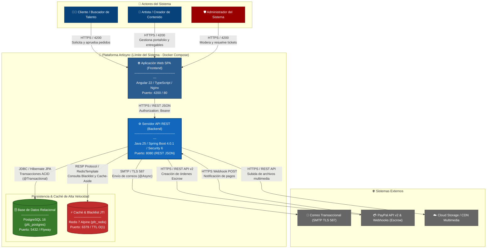

# Diagrama C4 Nivel 2: Contenedores (Container Diagram) - Artisync PFC

Este documento detalla el **Nivel 2 (Contenedores)** del modelo **C4** para la plataforma **Artisync**.

En este nivel se abre la caja negra del sistema para mostrar los **contenedores de software autónomos y desplegables** (servicios, bases de datos, sistemas de caché, interfaces web) que lo componen, junto con sus **tecnologías subyacentes**, **responsabilidades principales** e interacciones bajo protocolos específicos.

---

## 1. Catálogo de Contenedores y Especificaciones Técnicas

### 1.1 Contenedores Internos (Dentro del Límite de Artisync)
| Contenedor | Identificador Docker | Stack Tecnológico | Responsabilidad Principal |
| :--- | :--- | :--- | :--- |
| **Aplicación Web SPA (Frontend)** | `pfc_frontend` <br> *(Puerto 4200 / 80)* | **Angular 22**, TypeScript, HTML5/SCSS, RxJS, Nginx | Proporciona la interfaz de usuario web responsiva de página única (SPA). Permite a Clientes, Artistas y Administradores autenticarse (2FA, JWT), explorar el catálogo dinámico, contratar servicios, gestionar hitos y tickets, y participar en la comunidad social. |
| **Servidor API REST (Backend)** | `pfc_backend` <br> *(Puerto 8080)* | **Java 25**, **Spring Boot 4.0.1**, Spring Security 6, Spring Data JPA / Hibernate, Flyway, Maven | Núcleo transaccional de la plataforma. Expone los endpoints RESTful documentados con OpenAPI/Swagger (`/api/docs`). Orquesta los 7 módulos funcionales (`seguridad`, `perfil`, `catalogo`, `pedido`, `legal`, `comunicacion`, `social`), gestiona transacciones ACID (`@Transactional`) y valida la seguridad sin estado con tokens JWT y consulta a Redis. |
| **Base de Datos Relacional** | `pfc_postgres` <br> *(Puerto 5432)* | **PostgreSQL 16** <br> *(Volumen: `pfc_postgres_data`)* | Almacén principal persistente y transaccional del sistema. Contiene los esquemas y tablas normalizadas (`usuarios`, `roles`, `pedidos`, `flujo_trabajos`, `pago_garantias`, etc.) gestionados y versionados estrictamente por migraciones de **Flyway** (`db/migration`). |
| **Almacén en Memoria / Caché** | `pfc_redis` <br> *(Puerto 6379)* | **Redis 7 Alpine** <br> *(Estructuras clave-valor in-memory)* | Almacén de ultra-baja latencia O(1). Mantiene la **Blacklist de tokens JWT** (`jti:<token>` con TTL según tiempo restante de expiración) y sesiones revocadas para permitir *logout* inmediato y bloqueo ante compromisos (`SessionRevocationService`). Implementa también el patrón **Cache-Aside** para el catálogo de servicios frecuentemente consultado. |

---

### 1.2 Sistemas y Contenedores Externos Integrados
| Sistema Externo | Tecnología / Protocolo | Responsabilidad e Interacción |
| :--- | :--- | :--- |
| **Servidor SMTP Transaccional** | **SMTP / TLS** (Puerto 587) <br> *Spring Boot Starter Mail (`EmailService`)* | Envío asíncrono (`@Async`) de plantillas HTML renderizadas con **Thymeleaf**: verificación de cuenta, códigos de autenticación 2FA, reseteo de contraseñas y alertas de hitos de pedidos. |
| **Pasarela PayPal (API v2 & Webhooks)** | **HTTPS / REST JSON** <br> *(PayPal Orders v2 / `PayPalConfig`)* | Procesamiento de pagos seguros. Gestión de retención de fondos en garantía (*Escrow* en `PagoGarantia`), capturas al aprobar entregables y recepción de Webhooks asíncronos para actualizar estados transaccionales en tiempo real. |
| **Almacenamiento Cloud / CDN** | **HTTPS / REST API** <br> *(Cloud Storage: S3 / Cloudinary)* | Almacenamiento externo escalable para imágenes multimedia de portafolio artístico, banners de perfiles, archivos adjuntos en el chat y entregables creativos de alta capacidad (`.zip`, `.psd`, `.mp4`). |

---

## 2. Código DSL para Structurizr Lite

El siguiente código DSL modela el contenedor para **Structurizr Lite**:

```groovy
workspace "Artisync - Plataforma para Artistas y Creadores de Contenido" "Diagrama C4 Nivel 2: Contenedores de Software" {

    model {
        cliente = person "Cliente / Buscador de Talento" "Usuario que busca servicios creativos, aprueba hitos y realiza depósitos en garantía." "Person"
        artista = person "Artista / Creador de Contenido" "Profesional que ofrece sus servicios, publica portafolio y gestiona pedidos." "Person"
        admin = person "Administrador del Sistema" "Supervisa la seguridad, roles granulares, modera catálogos y resuelve disputas legales." "Admin"

        smtpSystem = softwareSystem "Servicio de Correo Transaccional" "Servidor SMTP saliente (Gmail / SendGrid) para correos 2FA, verificación y alertas." "External System"
        paypalSystem = softwareSystem "Pasarela de Pagos (PayPal API v2)" "Plataforma externa para procesamiento transaccional, retención Escrow y notificaciones por Webhook." "External System"
        cloudStorageSystem = softwareSystem "Almacenamiento Cloud / CDN" "Servicio en nube para persistencia y streaming de recursos multimedia pesados." "External System"

        artisyncSystem = softwareSystem "Plataforma Artisync (PFC)" "Sistema integral de gestión para artistas y clientes con hitos, pagos en garantía y comunidad." "System" {
            
            webApp = container "Aplicación Web SPA (Frontend)" "Proporciona la interfaz gráfica interactiva, responsiva y orientada a componentes para todos los perfiles de usuario." "Angular 22 / TypeScript / Nginx" "WebBrowser"
            
            apiServer = container "Servicio API REST (Backend)" "Orquesta la lógica de negocio modular, autenticación JWT, seguridad e integración externa." "Java 25 / Spring Boot 4.0.1 / Spring Security 6" "Backend"
            
            db = container "Base de Datos Relacional" "Almacena los esquemas relacionales, datos de usuarios, pedidos, hitos y contratos migradas con Flyway." "PostgreSQL 16" "Database"
            
            cache = container "Almacén en Memoria / Blacklist" "Mantiene la lista de revocación de tokens JWT (JTI) en tiempo real con TTL y caché rápida de catálogos (Cache-Aside)." "Redis 7 Alpine" "Cache"
        }

        // Interacciones Usuarios -> Frontend
        cliente -> webApp "Accede a portafolio, cotiza pedidos, paga y aprueba hitos" "HTTPS / Puerto 4200/443"
        artista -> webApp "Gestiona catálogo, sube avances de hitos y cobra por proyectos" "HTTPS / Puerto 4200/443"
        admin -> webApp "Modera catálogos, asigna permisos y resuelve disputas" "HTTPS / Puerto 4200/443"

        // Interacciones Frontend -> Backend API
        webApp -> apiServer "Consume servicios REST, autentica con JWT Bearer e invoca comandos transaccionales" "HTTPS / REST JSON / Puerto 8080"

        // Interacciones Backend API -> Contenedores de Datos
        apiServer -> db "Lee y escribe entidades de dominio transaccionales (ACID) y ejecuta migraciones Flyway" "JDBC / TCP / Puerto 5432"
        apiServer -> cache "Consulta y almacena JTI en blacklist, sesiones revocadas y caché de catálogos" "Redis Protocol (RESP) / TCP / Puerto 6379"

        // Interacciones Backend API -> Sistemas Externos
        apiServer -> smtpSystem "Envía correos asíncronos (@Async) con plantillas Thymeleaf" "SMTP / TLS / Puerto 587"
        apiServer -> paypalSystem "Crea órdenes y gestiona depósitos de garantía Escrow" "HTTPS / REST JSON v2"
        paypalSystem -> apiServer "Envía notificaciones de pago confirmadas o disputadas" "HTTPS / Webhooks (POST)"
        apiServer -> cloudStorageSystem "Sube y genera URLs pre-firmadas para recursos multimedia" "HTTPS / REST S3"
    }

    views {
        container artisyncSystem "C4_Containers_Artisync" {
            include *
            autoLayout topBottom
            description "Diagrama C4 Nivel 2 (Contenedores) que muestra la arquitectura distribuida de la plataforma Artisync."
        }

        styles {
            element "Person" { shape Person; background #08427b; color #ffffff; fontSize 20; }
            element "Admin" { shape Person; background #990000; color #ffffff; fontSize 20; }
            element "WebBrowser" { shape WebBrowser; background #2b5c8f; color #ffffff; fontSize 18; }
            element "Backend" { shape RoundedBox; background #1168bd; color #ffffff; fontSize 18; fontStyle bold; }
            element "Database" { shape Cylinder; background #387c2b; color #ffffff; fontSize 18; }
            element "Cache" { shape Cylinder; background #c12c2c; color #ffffff; fontSize 18; }
            element "External System" { shape RoundedBox; background #999999; color #ffffff; fontSize 18; }
        }
    }
}
```

---

## 3. Código C4-PlantUML

Código PlantUML listo para exportar a PNG/SVG de alta resolución desde VS Code o `draw.io`:

```plantuml
@startuml C4_Nivel2_Contenedores_Artisync
!include https://raw.githubusercontent.com/plantuml-stdlib/C4-PlantUML/master/C4_Container.puml

LAYOUT_WITH_LEGEND()
LAYOUT_TOP_DOWN()

title Diagrama de Contenedores (Nivel 2) - Plataforma Artisync (PFC)

Person(cliente, "Cliente / Buscador de Talento", "Explora portafolios, solicita cotizaciones, realiza pagos en garantía y aprueba hitos.")
Person(artista, "Artista / Creador de Contenido", "Publica catálogo y tarifas, gestiona pedidos activos y sube entregables creativos.")
Person(admin, "Administrador de la Plataforma", "Modera catálogos, gestiona usuarios/roles y arbitra disputas en tickets de revisión.")

System_Boundary(artisync_boundary, "Plataforma Artisync (PFC)") {
    Container(frontend, "Aplicación Web SPA", "Angular 22, TypeScript, Nginx", "Interfaz de usuario responsiva. Gestiona flujos de navegación, autenticación, formularios, carga de archivos y visualización del portafolio.")
    
    Container(backend, "Servidor API REST", "Java 25, Spring Boot 4.0.1, Spring Security 6, Hibernate", "Orquestador central. Lógica de negocio de los 7 módulos, validación de reglas, autenticación sin estado JWT y gestión de transacciones.")
    
    ContainerDb(db, "Base de Datos Relacional", "PostgreSQL 16 (pfc_postgres:5432)", "Almacén de datos persistente y relacional (ACID). Contiene usuarios, roles, pedidos, contratos y migraciones de Flyway.")
    
    ContainerDb(cache, "Caché en Memoria & Blacklist", "Redis 7 Alpine (pfc_redis:6379)", "Almacén clave-valor O(1). Gestiona la lista negra de tokens JWT (JTI) y sesiones revocadas con TTL, más caché transaccional (Cache-Aside).")
}

System_Ext(smtp, "Servicio de Correo Transaccional", "SMTP TLS (Puerto 587) - Envio de correos 2FA y plantillas de recuperación.")
System_Ext(paypal, "Pasarela de Pagos (PayPal API v2)", "HTTPS / REST JSON - Procesamiento de órdenes y retención de depósitos Escrow.")
System_Ext(storage, "Almacenamiento Cloud / CDN", "HTTPS / REST S3 - Persistencia de archivos pesados multimedia del portafolio y entregables.")

Rel(cliente, frontend, "Explora catálogo, cotiza, paga en garantía y revisa hitos", "HTTPS / Puerto 4200/443")
Rel(artista, frontend, "Publica servicios, sube avances de pedidos y cobra", "HTTPS / Puerto 4200/443")
Rel(admin, frontend, "Gestiona roles, modera catálogos y resuelve disputas", "HTTPS / Puerto 4200/443")

Rel(frontend, backend, "Consume peticiones REST transaccionales y autenticadas", "HTTPS / REST JSON Bearer JWT (Puerto 8080)")

Rel(backend, db, "Lee/Escribe entidades JPA transaccionales y ejecuta Flyway", "JDBC / TCP (Puerto 5432)")
Rel(backend, cache, "Verifica JTI en blacklist (O(1)) y gestiona caché de catálogos", "Redis Protocol RESP / TCP (Puerto 6379)")

Rel(backend, smtp, "Envía correos electrónicos asíncronos (@Async)", "SMTP / TLS (Puerto 587)")
Rel(backend, paypal, "Crea órdenes transaccionales y gestiona fondos Escrow", "HTTPS / REST JSON v2")
Rel(paypal, backend, "Confirma transacciones o disputas de forma asíncrona", "HTTPS / Webhooks (POST)")
Rel(backend, storage, "Gestiona subida y URLs seguras para archivos multimedia", "HTTPS / REST API")

@enduml
```

---

## 4. Visualización con Mermaid (Renderizado Nativo en Markdown)



---

## 5. Mapeo con Docker Compose (`docker-compose.yml`)

El diseño de contenedores se refleja 1:1 con la orquestación implementada en el archivo `docker-compose.yml` del repositorio:

| Contenedor C4 | Servicio Docker | Imagen / Build Context | Puertos Mapeados | Dependencias (`depends_on`) | Healthcheck |
| :--- | :--- | :--- | :--- | :--- | :--- |
| **Base de Datos** | `postgres` | `postgres:16` | `5432:5432` | N/A | `pg_isready -U pfc_user -d pfc_db` |
| **Caché en Memoria** | `redis` | `redis:7-alpine` | `6379:6379` | N/A | `redis-cli ping` |
| **Backend API REST** | `backend` | `./Backend (Dockerfile)` | `8080:8080` | `postgres` (service_healthy), <br> `redis` (service_healthy) | `wget -qO- http://localhost:8080/actuator/health` |
| **Frontend Web SPA** | `frontend` | `./Frontend (Dockerfile)` | `4200:4200` | `backend` (service_healthy) | Servidor web Nginx |
