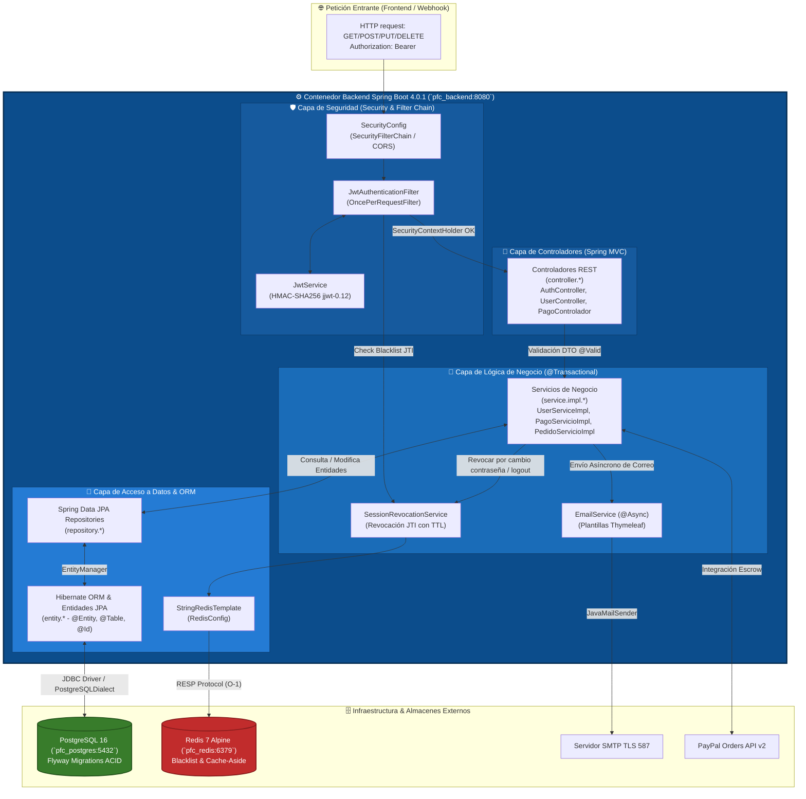

# Diagrama C4 Nivel 3: Componentes del Backend (Component Diagram) - Artisync PFC

Este documento describe el **Nivel 3 (Componentes)** de la metodología **C4 Model** aplicado al contenedor de mayor complejidad técnica de la plataforma: el **Servicio API REST (`pfc_backend`)**.

En este nivel se descompone el contenedor interior en sus **componentes estructurales e interconectados** (paquetes y capas arquitectónicas de Spring Boot), detallando sus responsabilidades, tecnologías específicas y flujo de dependencias durante el procesamiento transaccional.

---

## 1. Descomposición por Capas de Componentes (`uteq.edu.ec.artisync.*`)

### 1.1 Capa de Controladores REST (`controller.*`)
- **Responsabilidad**: Punto de entrada de todas las peticiones HTTP/HTTPS que ingresan a la API. Mapea endpoints (`@RestController`, `@RequestMapping`), deserializa DTOs JSON de entrada (`request`), ejecuta validaciones declarativas (`@Valid`, `@NotNull`, `@Size`) y encapsula las respuestas en `ResponseEntity<T>` e intercepciones de errores.
- **Componentes Principales**:
  - `AuthController`: Gestión de registro, login, refresh token, verificación de correo y logout (`/api/auth/**`).
  - `UserController` & `AdminUserController`: Gestión del perfil del usuario actual, cambio de contraseñas, listado y bloqueo administrativo (`/api/users/**`, `/api/admin/users/**`).
  - `TwoFactorController`: Activación, validación y verificación de autenticación de dos factores (`/api/auth/2fa/**`).
  - `PagoControlador` & `PayPalWebhookControlador`: Gestión de retención de pagos en garantía (*Escrow*) y recepción asíncrona de webhooks transaccionales de PayPal (`/api/pagos/**`, `/api/webhooks/paypal`).
  - Controladores de módulos funcionales: `PerfilController`, `CatalogoController`, `PedidoController`, `ComunicacionController`, `SocialController`.

---

### 1.2 Capa de Filtros y Middleware de Seguridad (`security.*` & `config.*`)
- **Responsabilidad**: Interceptar cada petición HTTP *antes* de que alcance los controladores REST para garantizar una seguridad sin estado (*stateless*). Valida firmas JWT, verifica expiraciones, consulta la lista negra (blacklist) en Redis, extrae el contexto del usuario (`CustomUserDetails`) y aplica control de acceso granular (`@PreAuthorize`).
- **Componentes Principales**:
  - `SecurityConfig`: Configura la cadena de filtros de Spring Security (`SecurityFilterChain`), CORS, protección CSRF deshabilitada (por arquitectura stateless JWT) y permisos públicos/privados.
  - `JwtAuthenticationFilter`: Filtro `OncePerRequestFilter` que extrae el *Header* `Authorization: Bearer <token>`, valida su autenticidad y establece el `SecurityContextHolder`.
  - `JwtService`: Servicio criptográfico responsable de firmar (`HMAC-SHA256`), emitir y verificar claims y el `jti` (JWT ID) mediante la biblioteca `jjwt-0.12.x`.
  - `CustomUserDetailsService` & `CustomUserDetails`: Carga al usuario desde PostgreSQL junto con su jerarquía de roles y permisos granulares (`RolePermission`) para autorización *RBAC/PBAC*.
  - `CustomAuthenticationEntryPoint`: Intercepta fallos de autenticación (401 Unauthorized) devolviendo respuestas JSON estructuradas.

---

### 1.3 Capa de Servicios de Negocio (`service.*` & `service.shared.*`)
- **Responsabilidad**: Núcleo donde se ejecuta y coordina toda la lógica y transaccionalidad de negocio de Artisync. Abre y gestiona límites transaccionales (`@Transactional`), orquestando llamadas a repositorios, validaciones complejas entre módulos y envíos asíncronos a servicios externos.
- **Componentes Principales**:
  - `AuthServiceImpl` & `UserServiceImpl`: Lógica de autenticación, alta de usuarios con hash de contraseña (`PasswordEncoder` BCrypt), actualización de perfiles e invalidación de sesiones.
  - `SessionRevocationService`: Gestión de cierre de sesión unificado. Extrae el `jti` del token actual y lo almacena directamente en el clúster Redis (`jti:<id>`) con TTL exacto al tiempo de vida restante del JWT.
  - `EmailService`: Componente `@Async` responsable del renderizado de plantillas HTML (`Thymeleaf`) y envío de correos transaccionales vía `JavaMailSender`.
  - `PagoServicioImpl`: Lógica de retención, liberación (*Escrow*) y conciliación financiera de pedidos en integración con `PayPalConfig`.
  - Servicios especializados de módulos: `PedidoServicioImpl`, `FlujoTrabajoServicioImpl`, `ServicioCatalogoServicioImpl`, `TicketRevisionServicioImpl`.

---

### 1.4 Capa de Repositorios / Spring Data (`repository.*`)
- **Responsabilidad**: Abstracción del acceso a la capa relacional. Declara interfaces Java que extienden `JpaRepository<T, ID>` y `JpaSpecificationExecutor<T>` para construir consultas dinámicas, filtros multicriterio, paginación avanzada (`Pageable`) y *Dirty Checking*.
- **Componentes Principales**:
  - `UsuarioRepository`, `SesionUsuarioRepository`, `AutenticacionDosFactoresRepository`, `UsuarioRolRepository`.
  - `PagoGarantiaRepository`: Persistencia de transacciones de depósito en garantía y auditoría de cambios de estado.
  - Repositorios de entidades core: `PedidoRepository`, `FlujoTrabajoRepository`, `ServicioRepository`, `PerfilRepository`.

---

### 1.5 ORM / Capa de Entidades (`entity.*` via Hibernate / JPA)
- **Responsabilidad**: Mapeo relacional de objetos (*Object-Relational Mapping*). Define las entidades del dominio anotadas con `@Entity`, `@Table`, `@Id`, `@Version` y relaciones estructurales (`@OneToMany`, `@ManyToOne`, `@ManyToMany`). Trabaja en estrecha colaboración con **Hibernate** para traducir operaciones POJO transaccionales en sentencias SQL nativas optimizadas para **PostgreSQL 16**.
- **Componentes Principales**:
  - Entidades de Seguridad: `Usuario`, `Rol`, `Permiso`, `RolePermission`, `SesionUsuario`, `AutenticacionDosFactores`.
  - Entidades de Negocio: `PagoGarantia`, `Pedido`, `FlujoTrabajo`, `Servicio`, `Categoria`, `TicketRevision`.

---

### 1.6 Componente Cliente de Caché (`config.RedisConfig` & `RedisTemplate`)
- **Responsabilidad**: Configurar y exponer las plantillas de serialización (`StringRedisSerializer`) para conexión de alto rendimiento vía TCP con el servidor **Redis 7**. Permite consultas clave-valor en $O(1)$ tanto para comprobación de *Blacklist* (`opsForValue().get("jti:...")`) como para el patrón **Cache-Aside** en el catálogo de servicios.

---

## 2. Código DSL para Structurizr Lite

DSL para simular e inspeccionar el contenedor `pfc_backend` a nivel de componentes:

```groovy
workspace "Artisync - Plataforma para Artistas y Creadores" "Diagrama C4 Nivel 3: Componentes de pfc_backend" {

    model {
        webApp = container "Aplicación Web SPA (Frontend)" "Angular 22 / Nginx" "WebBrowser"
        db = container "Base de Datos Relacional" "PostgreSQL 16" "Database"
        cache = container "Almacén en Memoria / Blacklist" "Redis 7 Alpine" "Cache"
        smtpSystem = softwareSystem "Servicio de Correo Transaccional" "Servidor SMTP / TLS 587" "External System"
        paypalSystem = softwareSystem "Pasarela PayPal API v2" "Orders v2 & Webhooks" "External System"

        apiServer = container "Servidor API REST (Backend)" "Java 25 / Spring Boot 4.0.1 / Spring Security 6" "Backend" {
            
            securityFilter = component "Filtros de Seguridad JWT (SecurityFilterChain)" "Intercepta solicitudes HTTP, valida el token Bearer, consulta blacklist y establece el contexto de seguridad." "Spring Security / JwtAuthenticationFilter / JwtService"
            
            controllerLayer = component "Controladores REST (controller.*)" "Mapea endpoints JSON, valida DTOs de entrada (@Valid) e invoca a la capa de servicios." "Spring MVC / @RestController"
            
            serviceLayer = component "Servicios de Negocio Transaccionales (service.*)" "Orquesta reglas de negocio, transacciones ACID (@Transactional), mappers y coordinación entre módulos." "Spring Service / @Transactional / UsuarioMapper"
            
            emailComponent = component "Servicio de Correo (@Async EmailService)" "Procesa y envía plantillas de correo HTML (Thymeleaf) en segundo plano." "Spring Mail / JavaMailSender / Thymeleaf"
            
            sessionRevocation = component "Servicio de Revocación de Sesiones" "Gestiona el ciclo de vida de sesiones y escribe los IDs de tokens revocados con su TTL exacto." "SessionRevocationService"
            
            repositoryLayer = component "Capa de Repositorios JPA (repository.*)" "Abstrae operaciones CRUD y consultas dinámicas complejas (Specification)." "Spring Data JPA / JpaRepository"
            
            ormLayer = component "ORM & Entidades JPA (entity.* + Hibernate)" "Mapea objetos Java al modelo relacional y genera SQL dialéctico para PostgreSQL." "Hibernate ORM / JPA @Entity"
            
            redisClient = component "Cliente Redis & Serializador (RedisConfig)" "Proporciona conexión TCP O(1) con el servidor Redis para caché y blacklist." "Spring Data Redis / StringRedisTemplate"
        }

        // Flujos externos hacia el contenedor
        webApp -> securityFilter "Petición HTTP/REST con Header Authorization: Bearer <JWT>" "HTTPS / REST JSON"
        paypalSystem -> controllerLayer "Webhook transaccional de estado de pago Escrow" "HTTPS POST / JSON"

        // Dependencias internas dentro de pfc_backend
        securityFilter -> sessionRevocation "Verifica si el JTI del token ha sido revocado" "Llamada Java"
        securityFilter -> controllerLayer "Delega petición autenticada y autorizada" "Spring DispatcherServlet"
        
        controllerLayer -> serviceLayer "Ejecuta comandos de negocio y consultas DTO" "Llamada Java"
        
        serviceLayer -> repositoryLayer "Consulta o persiste entidades transaccionales" "Llamada Java"
        serviceLayer -> emailComponent "Envia correos de bienvenida, 2FA o reseteo (@Async)" "Llamada Java Asíncrona"
        serviceLayer -> sessionRevocation "Revoca sesiones por cambio de clave o logout" "Llamada Java"
        
        sessionRevocation -> redisClient "Escribe/Lee clave 'jti:<id>' con TTL en milisegundos" "StringRedisTemplate"
        redisClient -> cache "Ejecuta comandos RESP (GET, SET, EXPIRE)" "TCP / Puerto 6379"
        
        repositoryLayer -> ormLayer "Delega persistencia y seguimiento de cambios (Dirty Checking)" "JPA API / EntityManager"
        ormLayer -> db "Ejecuta sentencias SQL (SELECT, INSERT, UPDATE, DELETE)" "JDBC / PostgreSQL Driver / Puerto 5432"
        
        emailComponent -> smtpSystem "Transmite correo saliente en formato MIME HTML" "SMTP / TLS / Puerto 587"
        serviceLayer -> paypalSystem "Crea y confirma órdenes de retención en garantía (Escrow)" "HTTPS / REST JSON"
    }

    views {
        component apiServer "C4_Components_Backend" {
            include *
            autoLayout topBottom
            description "Diagrama C4 Nivel 3 (Componentes) que ilustra las capas arquitectónicas de Spring Boot en pfc_backend."
        }

        styles {
            element "Component" { shape RoundedBox; background #1168bd; color #ffffff; fontSize 16; }
            element "Backend" { shape RoundedBox; background #0c4d8c; color #ffffff; fontSize 18; fontStyle bold; }
            element "Database" { shape Cylinder; background #387c2b; color #ffffff; fontSize 16; }
            element "Cache" { shape Cylinder; background #c12c2c; color #ffffff; fontSize 16; }
            element "External System" { shape RoundedBox; background #999999; color #ffffff; fontSize 16; }
            element "WebBrowser" { shape WebBrowser; background #2b5c8f; color #ffffff; fontSize 16; }
        }
    }
}
```

---

## 3. Código C4-PlantUML

```plantuml
@startuml C4_Nivel3_Componentes_Backend_Artisync
!include https://raw.githubusercontent.com/plantuml-stdlib/C4-PlantUML/master/C4_Component.puml

LAYOUT_WITH_LEGEND()
LAYOUT_TOP_DOWN()

title Diagrama de Componentes (Nivel 3) - Contenedor API REST (`pfc_backend`)

Container(webApp, "Aplicación Web SPA", "Angular 22, TypeScript", "Envía peticiones REST y tokens Bearer JWT al backend.")
System_Ext(paypal, "Pasarela PayPal API v2", "Envia Webhooks de estado de pago Escrow.")

Container_Boundary(backend_boundary, "Contenedor: Servidor API REST (Spring Boot 4.0.1 / Java 25)") {
    
    Component(securityFilter, "Filtro de Seguridad & JWT", "JwtAuthenticationFilter, SecurityConfig, JwtService", "Intercepta HTTP, verifica firma HMAC, comprueba expiración e interroga a Redis por Blacklist.")
    
    Component(controllers, "Controladores REST", "controller.* (@RestController)", "Mapea rutas (/api/**), valida esquemas de entrada (@Valid) y maneja DTOs y errores HTTP.")
    
    Component(services, "Capa de Servicios transaccionales", "service.* (@Transactional)", "Implementa transacciones transaccionales ACID, lógica de los 7 módulos y coordinación de mappers.")
    
    Component(sessionRevocation, "SessionRevocationService", "service.shared.SessionRevocationService", "Gestiona revocación de tokens y sesiones guardando el JTI en Redis con TTL exacto.")
    
    Component(emailService, "EmailService (@Async)", "service.shared.EmailService", "Procesa plantillas HTML Thymeleaf (email/recuperacion) y gestiona cola de correos salientes.")
    
    Component(repositories, "Repositorios Spring Data", "repository.* (JpaRepository)", "Abstrae el acceso a datos transaccional con soporte de paginación y especificaciones (Specifications).")
    
    Component(orm, "Capa ORM & Entidades JPA", "entity.* + Hibernate ORM", "Traduce entidades de dominio Java (@Entity) en sentencias SQL optimizadas para PostgreSQL.")
    
    Component(redisClient, "Cliente & Serializador Redis", "config.RedisConfig + StringRedisTemplate", "Gestiona conexiones I/O O(1) vía TCP con el clúster Redis.")
}

ContainerDb(db, "PostgreSQL 16", "pfc_postgres:5432", "Base de datos relacional ACID (Esquema migrado por Flyway).")
ContainerDb(cache, "Redis 7 Alpine", "pfc_redis:6379", "Almacén in-memory para Blacklist JWT y Cache-Aside.")
System_Ext(smtp, "Servicio SMTP", "Puerto 587 TLS", "Envio de correos transaccionales.")

Rel(webApp, securityFilter, "Petición REST + Header Authorization: Bearer <JWT>", "HTTPS JSON")
Rel(paypal, controllers, "Webhook POST con eventos transaccionales", "HTTPS JSON")

Rel(securityFilter, sessionRevocation, "Verifica si token está en Blacklist (JTI)", "Llamada Java")
Rel(securityFilter, controllers, "Delega petición autenticada y autorizada", "DispatcherServlet")

Rel(controllers, services, "Invocación de métodos transaccionales y paso de DTOs", "Llamada Java")

Rel(services, repositories, "Ejecuta queries y mutaciones transaccionales", "Llamada Java")
Rel(services, emailService, "Solicita envío asíncrono de notificación 2FA o reseteo", "Llamada Java (@Async)")
Rel(services, sessionRevocation, "Revoca sesiones (logout / cambio de clave)", "Llamada Java")
Rel(services, paypal, "Crea y confirma órdenes de retención en garantía (Escrow)", "HTTPS REST v2")

Rel(sessionRevocation, redisClient, "Almacena/Consulta 'jti:<id>' con tiempo de vida restante", "StringRedisTemplate")
Rel(redisClient, cache, "Ejecuta comandos RESP O(1)", "TCP (Puerto 6379)")

Rel(repositories, orm, "Delega persistencia y gestión del EntityManager", "JPA API")
Rel(orm, db, "Ejecuta SQL dialéctico (SELECT, INSERT, UPDATE)", "JDBC TCP (Puerto 5432)")
Rel(emailService, smtp, "Transmite mensajes MIME en formato HTML", "SMTP / TLS (Puerto 587)")

@enduml
```

---

## 4. Visualización de Dependencias Arquitectónicas con Mermaid



---

## 5. Mapeo con los Paquetes del Código Fuente

| Capa Arquitectónica C4 | Paquete Java en `backend/src/main/java/uteq/edu/ec/artisync/` | Clases Clave Representativas |
| :--- | :--- | :--- |
| **Filtros y Seguridad** | `security.*` y `config.SecurityConfig` | `JwtAuthenticationFilter.java`, `JwtService.java`, `CustomUserDetailsService.java` |
| **Controladores REST** | `controller.*` | `AuthController.java`, `UserController.java`, `PagoControlador.java` |
| **Servicios Transaccionales** | `service.*`, `service.impl.*`, `service.shared.*` | `UserServiceImpl.java`, `PagoServicioImpl.java`, `SessionRevocationService.java`, `EmailService.java` |
| **Repositorios de Datos** | `repository.*` | `UsuarioRepository.java`, `SesionUsuarioRepository.java`, `PagoGarantiaRepository.java` |
| **ORM / Entidades JPA** | `entity.*` | `Usuario.java`, `SesionUsuario.java`, `PagoGarantia.java`, `Pedido.java` |
| **Configuración de Infra** | `config.*` | `RedisConfig.java`, `PayPalConfig.java`, `OpenApiConfig.java` |
