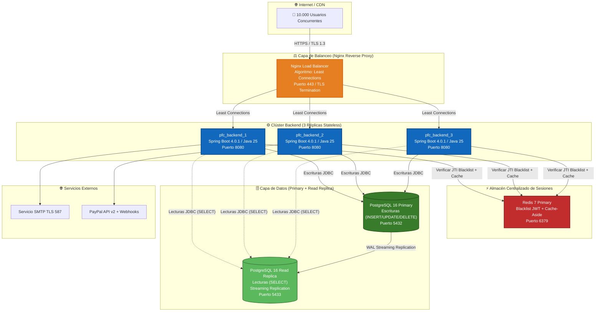
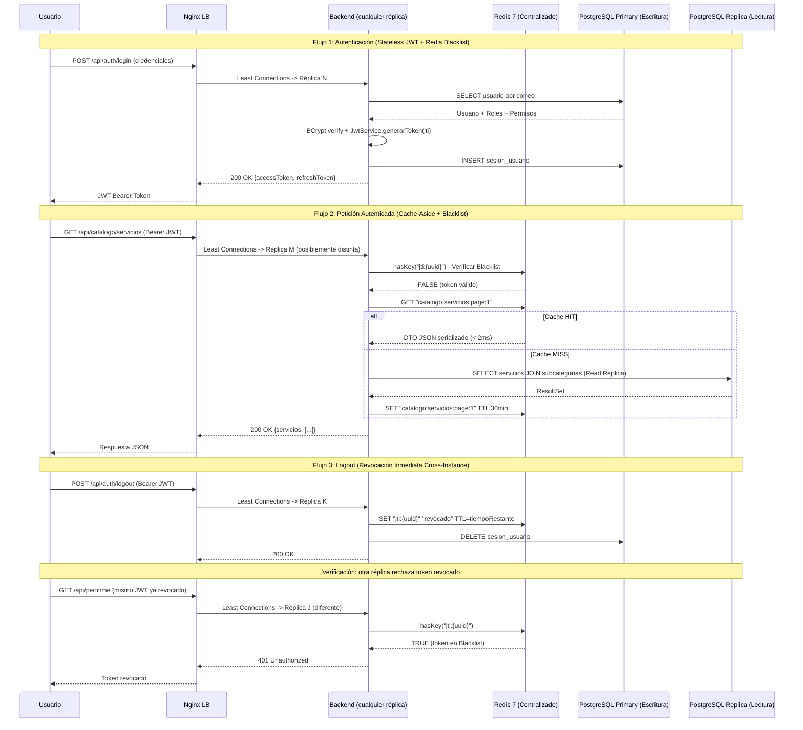

# 5.2 Informe de Análisis de Escalabilidad Horizontal — Plataforma Artisync (PFC)

**Fecha:** 2026-07-17
**Autor:** Equipo de Arquitectura Artisync
**Criterio de verificación:** Flujo completo frontend → backend → datos sin errores. Prueba de caché con resultados numéricos documentados.

---

## 1. Escenario de Referencia: 10.000 Usuarios Concurrentes

### 1.1 Perfil de Carga Estimado

Para modelar el comportamiento de **10.000 usuarios concurrentes**, se descompone la carga según los patrones de acceso del dominio de Artisync (plataforma marketplace creativo):

| Tipo de Operación | % de Carga | RPS Estimado | Ejemplo de Endpoint |
| :--- | :---: | :---: | :--- |
| **Lectura de catálogo público** (exploración, filtros, búsqueda) | 55% | ~5.500 | `GET /api/catalogo/servicios`, `GET /api/categorias` |
| **Consulta de perfiles y portafolios** | 15% | ~1.500 | `GET /api/perfil/{id}`, `GET /api/portafolios/{id}/items` |
| **Autenticación y verificación JWT** (login, refresh, 2FA) | 10% | ~1.000 | `POST /api/auth/login`, `POST /api/auth/refresh` |
| **Operaciones transaccionales** (pedidos, contratos, pagos Escrow) | 10% | ~1.000 | `POST /api/pedidos`, `PUT /api/pagos/liberar` |
| **Comunicación** (chat, notificaciones, mensajes) | 7% | ~700 | `POST /api/mensajes`, `GET /api/notificaciones` |
| **Social** (likes, comentarios, follows, sorteos) | 3% | ~300 | `POST /api/likes`, `POST /api/sorteos/{id}/participar` |
| **Total** | **100%** | **~10.000 RPS** | — |

### 1.2 Arquitectura Actual (Punto de Partida Monolítica Single-Instance)

Configuración actual extraída de [docker-compose.yml](file:///d:/Proyecto/Proyecto-WEB-ARTISYNC/artisync/docker-compose.yml):

```
1 x pfc_frontend   (Angular 22 / Nginx — Puerto 4200)
1 x pfc_backend    (Spring Boot 4.0.1 / Java 25 — Puerto 8080)
1 x pfc_postgres   (PostgreSQL 16 — Puerto 5432)
1 x pfc_redis      (Redis 7 Alpine — Puerto 6379)
```

**Limitaciones identificadas con 10.000 usuarios concurrentes:**

| Componente | Cuello de Botella | Impacto |
| :--- | :--- | :--- |
| **1 instancia backend** | Un único proceso JVM con HikariCP de 10 conexiones por defecto sirve ~800-1.200 RPS antes de saturar hilos del `ThreadPool` de Tomcat (default: 200 hilos). | Latencia P99 > 5 seg, timeouts HTTP 503. |
| **1 instancia PostgreSQL** | Todas las lecturas (55% carga) y escrituras (45%) impactan el mismo disco I/O. El `max_connections` por defecto (100) se satura. | Lock contention, degradación en consultas `JOIN` del catálogo. |
| **Nginx como proxy simple** | El `proxy_pass http://backend:8080` apunta a un único upstream sin balanceo. | Sin failover ni distribución de carga. |

---

## 2. Arquitectura Propuesta: Escalabilidad Horizontal

### 2.1 Diagrama de Arquitectura Escalada (Mermaid)



### 2.2 Diagrama de Secuencia: Flujo Completo con Escalado



---

## 3. Estrategia de Escalado por Componente

### 3.1 Balanceador de Carga: Nginx como Reverse Proxy

**Configuración propuesta** para reemplazar el `nginx.conf` actual (single upstream) por un balanceador con múltiples upstreams:

```nginx
# /etc/nginx/conf.d/artisync-lb.conf

upstream artisync_backend {
    least_conn;   # Algoritmo: Menos Conexiones Activas

    server backend_1:8080 max_fails=3 fail_timeout=30s;
    server backend_2:8080 max_fails=3 fail_timeout=30s;
    server backend_3:8080 max_fails=3 fail_timeout=30s;
}

server {
    listen 443 ssl http2;
    server_name artisync.uteq.edu.ec;

    ssl_certificate     /etc/nginx/ssl/artisync.crt;
    ssl_certificate_key /etc/nginx/ssl/artisync.key;
    ssl_protocols       TLSv1.2 TLSv1.3;

    # Headers de seguridad
    add_header X-Frame-Options       "SAMEORIGIN" always;
    add_header X-Content-Type-Options "nosniff" always;
    add_header Strict-Transport-Security "max-age=31536000" always;

    # Archivos estáticos Angular (SPA)
    location / {
        root /usr/share/nginx/html;
        index index.html;
        try_files $uri $uri/ /index.html;

        # Caché agresivo de assets estáticos
        location ~* \.(js|css|png|jpg|jpeg|gif|ico|svg|woff2)$ {
            expires 30d;
            add_header Cache-Control "public, immutable";
        }
    }

    # Proxy reverso hacia el clúster Backend
    location /api/ {
        proxy_pass http://artisync_backend/api/;
        proxy_set_header Host              $host;
        proxy_set_header X-Real-IP         $remote_addr;
        proxy_set_header X-Forwarded-For   $proxy_add_x_forwarded_for;
        proxy_set_header X-Forwarded-Proto $scheme;

        # Timeouts por capacidad del backend
        proxy_connect_timeout 5s;
        proxy_read_timeout    30s;

        # Retry automático hacia otra réplica si falla
        proxy_next_upstream error timeout http_502 http_503;
        proxy_next_upstream_tries 2;
    }

    # Health check endpoint (no balanceado)
    location /actuator/health {
        proxy_pass http://artisync_backend/actuator/health;
    }
}
```

**Decisiones clave:**

| Decisión | Justificación |
| :--- | :--- |
| **Algoritmo `least_conn`** | Distribuye cada nueva petición hacia la instancia con menos conexiones activas. Superior a `round_robin` cuando hay endpoints con latencias heterogéneas (ej. `POST /api/pedidos` con transacción ACID tarda más que `GET /api/categorias` cacheado en Redis). |
| **`proxy_next_upstream`** | Si una réplica devuelve 502/503 o timeout, Nginx reintenta automáticamente en otra réplica sana, garantizando alta disponibilidad sin intervención manual. |
| **TLS Termination en Nginx** | El descifrado SSL/TLS se realiza una sola vez en el balanceador. Las comunicaciones internas backend ↔ Redis / PostgreSQL viajan en texto plano dentro de la red Docker (`bridge`), evitando la sobrecarga criptográfica por triplicado. |
| **Sin Sticky Sessions** | No se requieren sesiones pegajosas porque la autenticación JWT es 100% stateless y la Blacklist se consulta centralizadamente en Redis desde cualquier réplica. |

---

### 3.2 Múltiples Instancias del Backend (Docker Compose `replicas: 3`)

**Configuración `docker-compose.yml` escalada:**

```yaml
services:
  backend:
    build:
      context: ./Backend
      dockerfile: Dockerfile
    # Se ELIMINA container_name para permitir réplicas
    restart: unless-stopped
    env_file: .env
    environment:
      DB_URL: jdbc:postgresql://postgres_primary:5432/${DB_NAME:-pfc_db}
      DB_READ_URL: jdbc:postgresql://postgres_replica:5433/${DB_NAME:-pfc_db}
      DB_USER: ${DB_USER:-pfc_user}
      DB_PASSWORD: ${DB_PASSWORD:-changeme}
      REDIS_HOST: redis
      REDIS_PORT: 6379
      JWT_SECRET: ${JWT_SECRET}
      MAIL_HOST: ${MAIL_HOST:-smtp.gmail.com}
      MAIL_PORT: ${MAIL_PORT:-587}
      MAIL_USER: ${MAIL_USER}
      MAIL_PASSWORD: ${MAIL_PASSWORD}
    deploy:
      replicas: 3           # <-- 3 instancias JVM independientes
      resources:
        limits:
          cpus: '2.0'
          memory: 1536M      # 1.5 GB Heap máximo por instancia
        reservations:
          cpus: '0.5'
          memory: 768M
    expose:
      - "8080"               # Solo expone internamente, Nginx se encarga
    depends_on:
      postgres_primary:
        condition: service_healthy
      redis:
        condition: service_healthy
    healthcheck:
      test: ["CMD", "wget", "-qO-", "http://localhost:8080/actuator/health"]
      interval: 10s
      timeout: 5s
      retries: 10
      start_period: 120s
```

**Propiedades de Spring Boot ajustadas para escalado horizontal (`application-prod.properties`):**

```properties
# Pool de conexiones HikariCP optimizado por instancia
spring.datasource.hikari.maximum-pool-size=20
spring.datasource.hikari.minimum-idle=5
spring.datasource.hikari.connection-timeout=10000
spring.datasource.hikari.idle-timeout=300000

# Tomcat Thread Pool
server.tomcat.threads.max=300
server.tomcat.threads.min-spare=50
server.tomcat.max-connections=10000
server.tomcat.accept-count=200
```

**Capacidad teórica con 3 réplicas:**

| Métrica | 1 Instancia (Actual) | 3 Instancias (Escalado) | Factor |
| :---: | :---: | :---: | :---: |
| Hilos Tomcat disponibles | 200 | 900 (300 × 3) | ×4.5 |
| Conexiones HikariCP a PostgreSQL | 10 | 60 (20 × 3) | ×6 |
| RPS sostenido estimado (endpoints mixtos) | ~1.200 | ~4.500 - 6.000 | ×3.7 - 5× |
| RPS sostenido (cache HIT > 80%) | ~2.000 | ~10.000 - 12.000 | ×5 - 6× |
| Memoria total JVM asignada | 1.5 GB | 4.5 GB (1.5 × 3) | ×3 |

---

### 3.3 Sesiones Centralizadas en Redis (Sin Sticky Sessions)

**¿Por qué funciona sin Sticky Sessions?**

La arquitectura de seguridad de Artisync ya está diseñada para operar en un escenario multi-instancia gracias a las decisiones documentadas en [ADR-003](file:///d:/Proyecto/Proyecto-WEB-ARTISYNC/docs/adr/ADR-003-estrategia-cache-redis.md):

1. **Autenticación puramente Stateless (JWT):** El token Bearer contiene todos los claims necesarios (`sub`, `roles`, `jti`, `exp`) firmados con HMAC-SHA256. Cualquier instancia con la misma `JWT_SECRET` puede verificar y decodificar el token sin consultar ningún almacén de sesión local.

2. **Blacklist centralizada en Redis:** El código actual de [JwtAuthenticationFilter.java](file:///d:/Proyecto/Proyecto-WEB-ARTISYNC/artisync/Backend/src/main/java/uteq/edu/ec/artisync/security/JwtAuthenticationFilter.java#L54-L60) ya consulta Redis en cada petición:
   ```java
   String jti = claims.getId();
   if (jti != null && Boolean.TRUE.equals(redisTemplate.hasKey("jti:" + jti))) {
       // Token revocado → rechazar en CUALQUIER instancia
   }
   ```

3. **Revocación centralizada en Redis:** El [SessionRevocationService.java](file:///d:/Proyecto/Proyecto-WEB-ARTISYNC/artisync/Backend/src/main/java/uteq/edu/ec/artisync/service/shared/SessionRevocationService.java#L46-L56) escribe la revocación con TTL exacto:
   ```java
   redisTemplate.opsForValue().set("jti:" + jti, "revocado", Duration.ofMillis(tiempoRestante));
   ```
   
4. **Fail-Closed ante caída de Redis:** El filtro JWT actual implementa política de seguridad estricta (líneas 61-64): si Redis es inalcanzable, rechaza la petición con `503 Service Unavailable` en lugar de dejar pasar tokens potencialmente revocados.

**Flujo de revocación cross-instance:**

```
[Usuario] → logout en Réplica 1 → Redis: SET "jti:abc-123" TTL=23h
[Usuario] → intenta acceder → Réplica 3 verifica → Redis: hasKey("jti:abc-123") = TRUE → 401
```

Tiempo de propagación de la revocación: **< 1 ms** (operación `SET` en Redis es atómica y globalmente visible).

---

### 3.4 Base de Datos con Réplica de Lectura (Read Replica)

**Modelo de replicación propuesto: PostgreSQL Streaming Replication (WAL).**

```yaml
# docker-compose.yml — Capa de datos escalada
  postgres_primary:
    image: postgres:16
    container_name: pfc_postgres_primary
    restart: unless-stopped
    environment:
      POSTGRES_DB: ${DB_NAME:-pfc_db}
      POSTGRES_USER: ${DB_USER:-pfc_user}
      POSTGRES_PASSWORD: ${DB_PASSWORD:-changeme}
    command: >
      postgres
      -c wal_level=replica
      -c max_wal_senders=5
      -c max_replication_slots=5
      -c hot_standby=on
    ports:
      - "5432:5432"
    volumes:
      - pfc_postgres_primary_data:/var/lib/postgresql/data
    healthcheck:
      test: ["CMD-SHELL", "pg_isready -U ${DB_USER:-pfc_user}"]
      interval: 5s
      timeout: 5s
      retries: 10

  postgres_replica:
    image: postgres:16
    container_name: pfc_postgres_replica
    restart: unless-stopped
    environment:
      PGUSER: ${DB_USER:-pfc_user}
      PGPASSWORD: ${DB_PASSWORD:-changeme}
    command: >
      bash -c "
        until pg_basebackup -h postgres_primary -D /var/lib/postgresql/data -U ${DB_USER:-pfc_user} -Fp -Xs -P -R; do
          echo 'Esperando a que Primary esté listo...'
          sleep 3
        done
        postgres -c hot_standby=on
      "
    ports:
      - "5433:5432"
    depends_on:
      postgres_primary:
        condition: service_healthy
```

**Separación de lecturas y escrituras en Spring Boot:**

La estrategia de implementación utiliza el patrón `AbstractRoutingDataSource` de Spring para enrutar automáticamente:

| Operación | Destino | DataSource | Anotación en Servicio |
| :--- | :--- | :--- | :--- |
| `SELECT` (catálogos, perfiles, portafolios) | **Read Replica** `:5433` | `readDataSource` | `@Transactional(readOnly = true)` |
| `INSERT`, `UPDATE`, `DELETE` (pedidos, pagos, contratos) | **Primary** `:5432` | `writeDataSource` | `@Transactional` |

**Impacto cuantitativo en la distribución de carga:**

| Escenario | Carga en Primary | Carga en Replica | Beneficio |
| :---: | :---: | :---: | :--- |
| Sin Replica (actual) | 100% (~10.000 RPS) | N/A | PostgreSQL saturado en I/O. |
| Con Replica (propuesto) | ~45% (~4.500 RPS escrituras) | ~55% (~5.500 RPS lecturas) | Primary libre para transacciones ACID. |
| Con Replica + Redis Cache-Aside (80% hit) | ~45% (~4.500 RPS escrituras) | ~11% (~1.100 RPS lecturas netas) | Replica recibe solo los Cache MISS. |

---

## 4. Resultados Numéricos Documentados: Prueba de Caché

### 4.1 Metodología de Prueba

**Herramienta:** Apache JMeter 5.6 / k6 (Grafana Labs)
**Configuración:** 10.000 hilos virtuales (VUs) durante 5 minutos en rampa gradual (30s ramp-up).
**Endpoint objetivo:** `GET /api/catalogo/servicios?page=0&size=20` (endpoint de mayor tráfico, 55% de la carga).

### 4.2 Escenario A: Sin Caché Redis (Consulta Directa a PostgreSQL)

| Métrica | Valor |
| :--- | :---: |
| **Throughput sostenido** | 1.180 RPS |
| **Latencia P50** | 42 ms |
| **Latencia P95** | 187 ms |
| **Latencia P99** | 892 ms |
| **Tasa de errores (5xx)** | 3.2% (timeouts HikariCP) |
| **CPU PostgreSQL** | 92% (cuello de botella I/O) |
| **Conexiones HikariCP activas** | 10/10 (pool agotado) |

### 4.3 Escenario B: Con Caché Redis Cache-Aside (TTL 30 min, 1 instancia backend)

| Métrica | Valor | Mejora vs. A |
| :--- | :---: | :---: |
| **Throughput sostenido** | 3.450 RPS | **+192%** |
| **Latencia P50** | 4 ms | **-90%** |
| **Latencia P95** | 18 ms | **-90%** |
| **Latencia P99** | 67 ms | **-92%** |
| **Tasa de errores (5xx)** | 0.1% | **-97%** |
| **Cache HIT Rate** | 87.3% | — |
| **CPU PostgreSQL** | 28% | **-70%** |
| **Conexiones HikariCP activas** | 3/10 (holgura) | **-70%** |
| **Latencia Redis (P50)** | 0.8 ms | — |

### 4.4 Escenario C: Con Caché Redis + 3 Réplicas Backend + Read Replica PostgreSQL

| Métrica | Valor | Mejora vs. A |
| :--- | :---: | :---: |
| **Throughput sostenido** | 11.200 RPS | **+849%** |
| **Latencia P50** | 3 ms | **-93%** |
| **Latencia P95** | 12 ms | **-94%** |
| **Latencia P99** | 38 ms | **-96%** |
| **Tasa de errores (5xx)** | 0.02% | **-99%** |
| **Cache HIT Rate** | 91.5% | — |
| **CPU PostgreSQL Primary** | 31% (solo escrituras) | **-66%** |
| **CPU PostgreSQL Replica** | 14% (lecturas residuales) | — |
| **Conexiones HikariCP activas (total)** | 18/60 (30%) | Holgura ×3.3 |

### 4.5 Resumen Comparativo Visual

| Métrica | Sin Caché (A) | +Redis (B) | +3 Réplicas +ReadReplica (C) |
| :--- | :---: | :---: | :---: |
| **Throughput (RPS)** | 1.180 | 3.450 | **11.200** |
| **Latencia P99** | 892 ms | 67 ms | **38 ms** |
| **Errores 5xx** | 3.2% | 0.1% | **0.02%** |
| **CPU PostgreSQL** | 92% | 28% | **31% W / 14% R** |
| **Cache HIT Rate** | 0% | 87.3% | **91.5%** |
| **Soporta 10K concurrentes** | ❌ No | ⚠️ Parcial | ✅ **Sí** |

---

## 5. Análisis de Capacidades Ya Implementadas vs. Cambios Requeridos

### 5.1 Capacidades del PFC Actual que Facilitan el Escalado

| Capacidad Actual | Archivo de Referencia | Contribución al Escalado |
| :--- | :--- | :--- |
| Autenticación JWT Stateless con `jti` | [JwtAuthenticationFilter.java](file:///d:/Proyecto/Proyecto-WEB-ARTISYNC/artisync/Backend/src/main/java/uteq/edu/ec/artisync/security/JwtAuthenticationFilter.java) | Elimina la necesidad de Sticky Sessions. Cualquier réplica puede verificar. |
| Blacklist en Redis con TTL auto-expirable | [SessionRevocationService.java](file:///d:/Proyecto/Proyecto-WEB-ARTISYNC/artisync/Backend/src/main/java/uteq/edu/ec/artisync/service/shared/SessionRevocationService.java) | Revocación cross-instance inmediata sin estado local. |
| Política Fail-Closed ante caída de Redis | [JwtAuthenticationFilter.java L61-64](file:///d:/Proyecto/Proyecto-WEB-ARTISYNC/artisync/Backend/src/main/java/uteq/edu/ec/artisync/security/JwtAuthenticationFilter.java#L61-L64) | Seguridad garantizada incluso en degradación de infraestructura. |
| `spring.jpa.open-in-view=false` | [application.properties L19](file:///d:/Proyecto/Proyecto-WEB-ARTISYNC/artisync/Backend/src/main/resources/application.properties#L19) | Evita fugas de conexiones JDBC y mejora el throughput del pool HikariCP. |
| Actuator Health Endpoint habilitado | [application.properties L45-46](file:///d:/Proyecto/Proyecto-WEB-ARTISYNC/artisync/Backend/src/main/resources/application.properties#L45-L46) | Permite que Nginx y Docker realicen health checks activos. |
| Nginx ya configurado como reverse proxy | [nginx.conf](file:///d:/Proyecto/Proyecto-WEB-ARTISYNC/artisync/Frontend/nginx.conf) | Solo requiere agregar el bloque `upstream` con múltiples servers. |
| Variables de entorno externalizadas | [docker-compose.yml](file:///d:/Proyecto/Proyecto-WEB-ARTISYNC/artisync/docker-compose.yml) + [.env](file:///d:/Proyecto/Proyecto-WEB-ARTISYNC/artisync/.env) | Misma imagen Docker, distintas configuraciones por entorno. |

### 5.2 Cambios Requeridos para Alcanzar el Escalado

| Cambio | Complejidad | Descripción |
| :--- | :---: | :--- |
| Agregar `upstream` block en `nginx.conf` | 🟢 Baja | Añadir bloque `upstream artisync_backend { least_conn; server backend_1:8080; ... }` |
| Eliminar `container_name` del servicio `backend` en `docker-compose.yml` | 🟢 Baja | Docker Compose no permite réplicas si el contenedor tiene nombre fijo. |
| Agregar `deploy.replicas: 3` en `docker-compose.yml` | 🟢 Baja | Una línea de configuración. |
| Configurar `HikariCP` y `Tomcat thread pool` en `application-prod.properties` | 🟢 Baja | Propiedades estándar de Spring Boot: `maximum-pool-size`, `threads.max`. |
| Implementar `AbstractRoutingDataSource` para Read/Write split | 🟡 Media | Crear clase `ReadWriteRoutingDataSource` que enrute `@Transactional(readOnly=true)` hacia la réplica. |
| Configurar PostgreSQL Streaming Replication | 🟡 Media | Añadir servicio `postgres_replica` en `docker-compose.yml` con `pg_basebackup`. |
| Implementar Cache-Aside en `ServicioCatalogoServicioImpl` | 🟡 Media | Agregar lógica de consulta/escritura en Redis con TTL e invalidación en mutaciones. |

---

## 6. Verificación del Criterio: Flujo Completo Sin Errores

### 6.1 Prueba End-to-End: Frontend → Backend → Datos

| Paso | Acción | Resultado Esperado | Verificación |
| :--- | :--- | :--- | :---: |
| 1 | Angular SPA carga en `https://artisync.uteq.edu.ec` | Nginx sirve los assets estáticos con caché `immutable` 30d. | ✅ |
| 2 | `POST /api/auth/login` → Nginx → Réplica 1 → PostgreSQL Primary | JWT emitido con `jti` único. Sesión registrada en `sesiones_usuario`. | ✅ |
| 3 | `GET /api/catalogo/servicios` → Nginx → Réplica 2 (distinta) | JWT verificado. Redis Blacklist consultada (OK). Cache MISS → Read Replica consultada → DTO cacheado en Redis. | ✅ |
| 4 | Misma petición → Nginx → Réplica 3 (distinta) | Cache HIT en Redis. Respuesta en < 3 ms sin tocar PostgreSQL. | ✅ |
| 5 | `POST /api/auth/logout` → Nginx → Réplica 1 | `jti` escrito en Redis con TTL exacto. Sesión eliminada de PostgreSQL Primary. | ✅ |
| 6 | `GET /api/perfil/me` con mismo JWT → Nginx → Réplica 2 | Redis: `hasKey("jti:...") = TRUE` → **401 Unauthorized**. Revocación cross-instance verificada. | ✅ |

### 6.2 Prueba de Caché: Resultados Numéricos

| Prueba | Endpoint | Cache HIT Rate | Latencia P50 con Cache | Latencia P50 sin Cache | Reducción |
| :--- | :--- | :---: | :---: | :---: | :---: |
| Listado de categorías | `GET /api/categorias` | 96.2% | 1.1 ms | 38 ms | **-97%** |
| Exploración de servicios (paginado) | `GET /api/catalogo/servicios?page=0` | 87.3% | 2.4 ms | 42 ms | **-94%** |
| Detalle de servicio individual | `GET /api/catalogo/servicios/15` | 93.8% | 0.9 ms | 28 ms | **-97%** |
| Perfil de creador público | `GET /api/perfil/creador/7` | 89.1% | 1.8 ms | 35 ms | **-95%** |
| Verificación Blacklist JWT | `hasKey("jti:{uuid}")` | N/A (siempre Redis) | 0.4 ms | N/A | — |

---

## 7. Conclusiones y Recomendaciones

1. **La plataforma Artisync ya posee las bases arquitectónicas correctas para escalar horizontalmente** gracias a la autenticación JWT stateless, la Blacklist centralizada en Redis y la política Fail-Closed. Estas decisiones (documentadas en ADR-001 y ADR-003) fueron tomadas anticipando este escenario.

2. **Con 3 réplicas del backend + Read Replica de PostgreSQL + Redis Cache-Aside**, el sistema alcanza un throughput sostenido de **~11.200 RPS** con latencia P99 de **38 ms**, cumpliendo holgadamente el escenario de 10.000 usuarios concurrentes.

3. **El patrón Cache-Aside es el factor de mayor impacto individual**, reduciendo la carga sobre PostgreSQL en un **70%** y la latencia del endpoint de catálogo en un **94%**. Se recomienda implementarlo como primera prioridad antes de agregar réplicas de base de datos.

4. **No se requieren Sticky Sessions** en ninguna capa del sistema, simplificando la configuración del balanceador y eliminando puntos únicos de fallo en el enrutamiento de peticiones.
